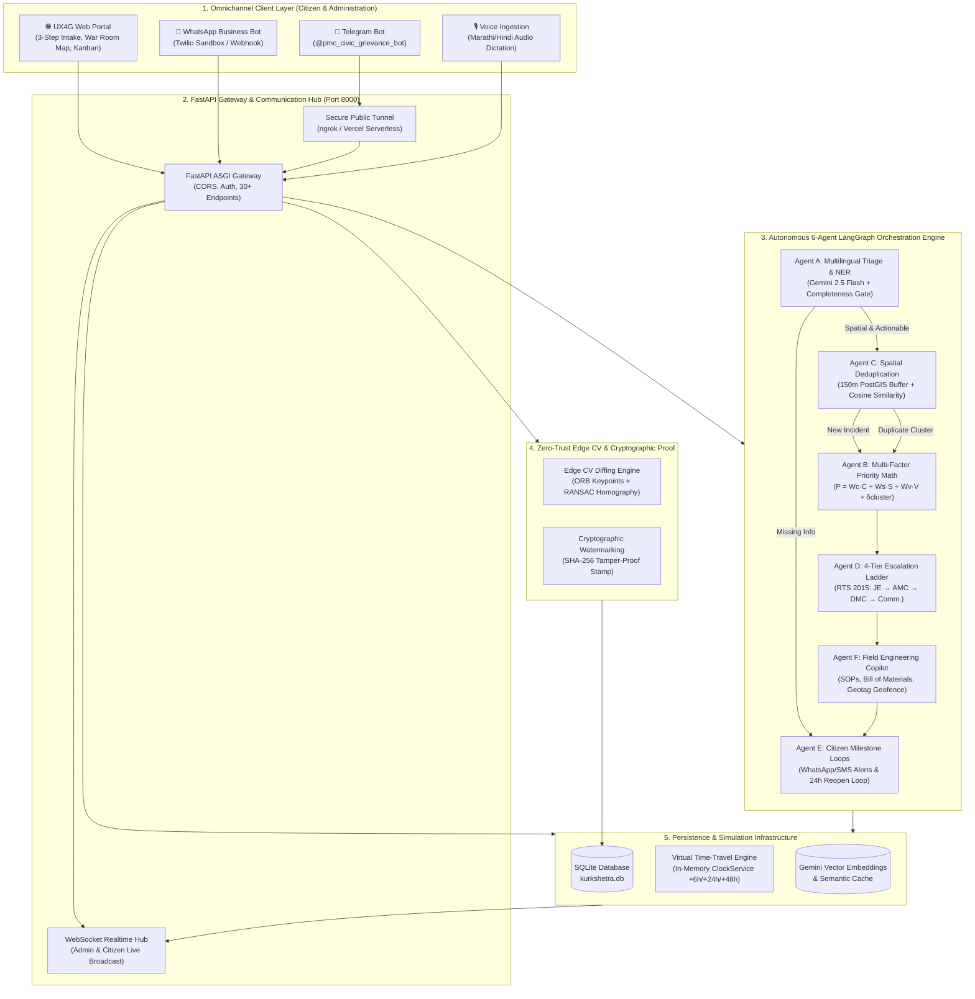
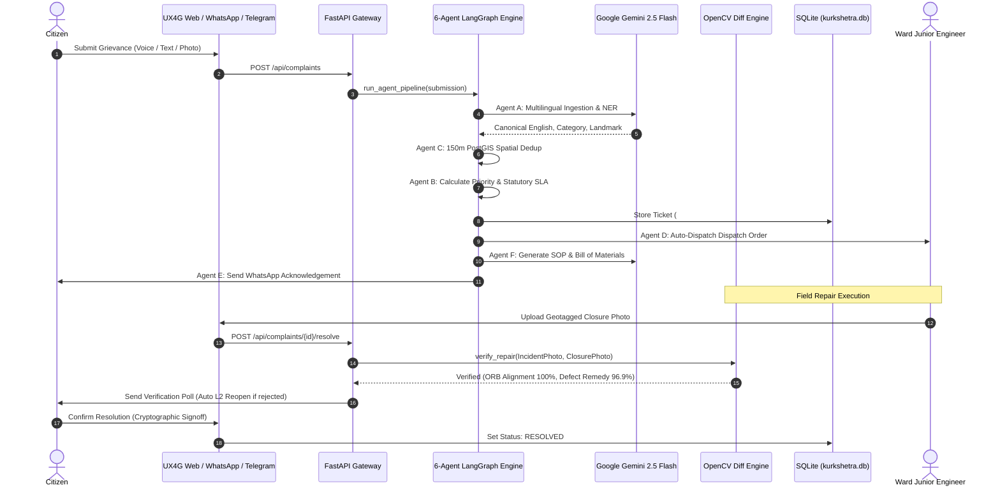

# 🏛️ NagrikSewa AI (PS17): System Architecture Specification

> **System Title:** Autonomous Multi-Agent Civic Grievance Operating System  
> **Statutory Compliance:** Maharashtra Right to Public Services Act (RTS 2015) & Municipal Corporation Act 1949  
> **Design Framework:** Government of India Unified Experience for Government (UX4G / GIGW 3.0)  
> **Core AI Stack:** LangGraph StateGraph v1.0 & Google Gemini 2.5 Flash  
> **Jurisdiction:** Pune Municipal Corporation (PMC Care) & PCMC  

---

## 1. Executive Architectural Overview

**NagrikSewa AI** is an enterprise-grade, autonomous civic governance platform designed under **Problem Statement 17 (PS17)**. It transforms traditional, manual municipal grievance tracking into a synchronized, multi-agent automated pipeline. 

The architecture bridges code-mixed citizen interactions (Marathi, Hindi, English via Web, Voice, WhatsApp, and Telegram) with a deterministic, mathematically verifiable execution engine that handles spatial deduplication, hazard priority modeling, statutory escalation enforcement, field engineering copilot workflows, and zero-trust edge computer vision repair auditing.



---

## 2. C4 Architecture Breakdown

### Level 1: System Context
NagrikSewa AI operates at the intersection of three major user personas and two external systems:
1. **Citizens**: Submit complaints in natural language (Marathi/Hindi/English), upload live geotagged camera photos, receive milestone SMS/WhatsApp updates, and verify contractor repairs.
2. **Municipal Field Crews (Junior Engineers / Linesmen)**: Receive automated dispatch orders, execute technical SOPs, draw Bill of Materials (BOM), and submit closure photos.
3. **Municipal Leadership (AMCs, DMCs, Municipal Commissioner)**: Monitor ward heatmaps, track real-time statutory SLA breach counts, and enforce disciplinary escalation.
4. **External Services**:
   - **Google Gemini 2.5 Flash**: Zero-shot multilingual entity extraction and SOP generation.
   - **Twilio / WhatsApp API**: Citizen notifications and interactive action buttons.
   - **Telegram API**: Conversational intake and status lookup.

---

### Level 2: Container Architecture

| Container | Technology | Responsibilities |
| :--- | :--- | :--- |
| **Frontend Web Client** | HTML5, Vanilla CSS3 (UX4G), ES6 JavaScript, Leaflet.js | Citizen grievance lodging wizard with live camera capture & Leaflet pinpoint map, Geospatial War Room Map, Kanban Redressal Board, 6-Agent Autonomous Lab. |
| **API Gateway** | Python 3.11+, FastAPI, Uvicorn | ASGI application server, REST routing, CORS handling, authentication session middleware, WebSocket broadcasting. |
| **Agent Orchestrator** | LangGraph StateGraph, Python | Manages the cyclic multi-agent workflow, shared incident state, condition routing, and error resilience. |
| **Computer Vision Engine** | OpenCV 4.12+, NumPy | Performs ORB feature detection, RANSAC homography geometric background alignment, and SSIM structural difference masking to prevent contractor photo gaming. |
| **Time-Travel Clock** | In-Memory Singleton `ClockService` | Manages virtual time offsets (`_offset_seconds`), advances simulated time (`+6h`, `+24h`, `+48h`), and triggers proactive SLA evaluation without external Redis dependencies. |
| **Persistent Storage** | SQLite 3 (`kurkshetra.db`) | Relational persistence of departments, officers, complaints, escalation records, closure verification hashes, and vector embeddings. |

---

## 3. The 6-Agent LangGraph StateGraph Topology

```
                         [ Citizen Grievance ]
                                  │
                                  ▼
                     ┌─────────────────────────┐
                     │     AGENT A: TRIAGE     │
                     │  (Multilingual NER &    │
                     │   Spatial Gatekeeper)   │
                     └────────────┬────────────┘
                                  │
                   [ Is Incident Actionable & Spatial? ]
                                 / \
                        YES     /   \   NO
                               ▼     ▼
         ┌────────────────────────┐   ┌────────────────────────┐
         │  AGENT C: DEDUP & POST │   │   AGENT E: CLARIFY     │
         │  GIS 150m CLUSTERING   │   │ (Auto-Prompt Citizen   │
         └───────────┬────────────┘   │  for Landmark/GPS)     │
                     │                └────────────────────────┘
          [ Nearby Active Incident? ]
                    / \
             YES   /   \   NO
                  ▼     ▼
         ┌───────────┐ ┌─────────────────────────┐
         │Cluster to │ │    AGENT B: PRIORITY    │
         │Parent &   │ │ (Multi-Factor Math &    │
         │Boost Delta│ │  Statutory RTS SLA)     │
         └─────┬─────┘ └────────────┬────────────┘
               │                    │
               └──────────► ◄───────┘
                            │
                            ▼
               ┌─────────────────────────┐
               │    AGENT D: DISPATCH    │
               │ (4-Tier RTS Escalation  │
               │  Ladder & Officer Match)│
               └────────────┬────────────┘
                            │
                            ▼
               ┌─────────────────────────┐
               │    AGENT F: COPILOT     │
               │ (Engineering SOP, BOM & │
               │  Geotag Offset Audit)   │
               └────────────┬────────────┘
                            │
                            ▼
               ┌─────────────────────────┐
               │   AGENT E: MILESTONES   │
               │ (WhatsApp, SMS Alerts   │
               │  & 24h Reopen Loop)     │
               └────────────┬────────────┘
                            │
                            ▼
                        [  END  ]
```

### 1. Agent A — Multilingual Ingestion & NER
- **Input**: Raw speech, Marathi audio transcription, or code-mixed text.
- **Engine**: Google Gemini 2.5 Flash (`temperature: 0.1`, `thinkingBudget: 0`).
- **Function**: Identifies language (Marathi/Hindi/English), standardizes into Canonical English, extracts key municipal entities (category, hazard, landmark, road), and executes the **Spatial Completeness Gatekeeper** to ensure an actionable address exists before field crew mobilization.

### 2. Agent C — Spatial Deduplication & Geodesic Clustering
- **Formula**: Haversine Geodesic Distance:
  $$d = 2R \arcsin \left( \sqrt{\sin^2\left(\frac{\Delta \phi}{2}\right) + \cos \phi_1 \cos \phi_2 \sin^2\left(\frac{\Delta \lambda}{2}\right)} \right)$$
- **Logic**: Evaluates incoming reports against all open incidents within a **150-meter PostGIS spatial window**. If semantic vector cosine similarity $\ge 0.85$, the report is merged into the parent cluster, incrementing `cluster_size` and boosting cluster priority while **preventing redundant crew dispatch**.

### 3. Agent B — Multi-Factor Priority Math & Statutory SLA
- **Formula**:
  $$P = (W_{\text{hazard}} \cdot S_{\text{hazard}}) + (W_{\text{traffic}} \cdot S_{\text{traffic}}) + (W_{\text{vulnerability}} \cdot S_{\text{density}}) + \delta_{\text{cluster}}$$
- **Statutory Mapping**:
  - $P \ge 85$ $\rightarrow$ **P1 CRITICAL** (2–6 Hours statutory SLA window)
  - $70 \le P < 85$ $\rightarrow$ **P2 HIGH** (12–18 Hours statutory SLA window)
  - $50 \le P < 70$ $\rightarrow$ **P3 MEDIUM** (24–36 Hours statutory SLA window)
  - $P < 50$ $\rightarrow$ **P4 LOW** (48 Hours statutory SLA window)

### 4. Agent D — 4-Tier Statutory RTS Escalation Ladder
Enforces administrative accountability under the **Maharashtra Right to Public Services Act (RTS 2015)**:
- **Tier 1 (Elapsed $< 80\%$ SLA)**: Ward Junior Engineer (Field Responder).
- **Tier 2 (Elapsed $\ge 80\%$ or $>6\text{h}$ Unacknowledged)**: Assistant Municipal Commissioner (AMC — Ward Officer).
- **Tier 3 (Elapsed $\ge 100\%$ SLA Breach)**: Deputy Municipal Commissioner (DMC — Zonal Head).
- **Tier 4 (Elapsed $\ge 150\%$ Critical Breach)**: Municipal Commissioner & Appellate Authority (IAS) for formal departmental inquiry.

### 5. Agent F — Field Engineering Copilot
- **Technical Checklist**: Automatically generates step-by-step safety and repair Standard Operating Procedures (SOPs).
- **Bill of Materials (BOM)**: Recommends required municipal hardware (pipes, collar clamps, SFRC manhole lids, 72W luminaires, polymer cold mix bitumen).
- **Geotag Geofencing**: Audits field closure photos against complaint coordinates ($\le 100\text{m}$ statutory threshold).

### 6. Agent E — Omnichannel Milestones & 24h Reopen Loop
- Emits real-time WhatsApp Business API and SMS milestone notifications.
- Embeds interactive action buttons: `[Track Live Location]`, `[Confirm Resolution]`, and `[Reopen Grievance (Auto L2 AMC)]`.
- Automatically enforces a 24-hour citizen signoff window before permanent database closure.

---

## 4. Zero-Trust Edge Computer Vision Architecture

To prevent field gaming (where contractors upload stock photos, photos of clean streets, or photos from different locations), the platform implements **Edge Computer Vision Structural Diffing**:

```
[ Initial Citizen Photo ]                      [ Contractor Closure Photo ]
           │                                                │
           ▼                                                ▼
┌─────────────────────────────────────────────────────────────────────────┐
│               1. ORB Feature Extraction (1200 Keypoints)                │
└────────────────────────────────────┬────────────────────────────────────┘
                                     │
                                     ▼
┌─────────────────────────────────────────────────────────────────────────┐
│         2. Brute Force Hamming Matcher & RANSAC Homography Matrix        │
│          (Aligns background geometry: curbs, buildings, trees)          │
└────────────────────────────────────┬────────────────────────────────────┘
                                     │
                                     ▼
┌─────────────────────────────────────────────────────────────────────────┐
│              3. Defect Removal Structural Difference Mask               │
│          (Verifies targeted physical remedy in foreground)              │
└────────────────────────────────────┬────────────────────────────────────┘
                                     │
                                     ▼
┌─────────────────────────────────────────────────────────────────────────┐
│ 4. Anti-Spoofing Verdict: GENUINE_SITE_REPAIR vs FIELD_GAMING_DETECTED  │
└─────────────────────────────────────────────────────────────────────────┘
```

- **Algorithm**: ORB Keypoint extraction (1200 features, 8 pyramid levels) + RANSAC Homography alignment + SSIM luminance/contrast diff mask.
- **Latency**: Sub-30ms execution per image pair on standard CPU.
- **Output**: Verified boolean, geometric alignment score ($0-100\%$), defect remedy score ($0-100\%$), and anti-spoofing audit verdict.

---

## 5. Data Flow & Sequence Diagram



---

## 6. Security, Compliance & Governance

1. **Maharashtra Right to Public Services Act (RTS 2015)**:
   - Mandatory statutory resolution deadlines strictly bound to priority scores.
   - Non-compliance automatically escalates to Appellate Authority with officer disciplinary audit logging.
2. **Municipal Corporation Act 1949**:
   - Administrative hierarchy and ward jurisdictions strictly mapped to Pune Municipal Corporation administrative codes.
3. **Government of India UX4G / GIGW 3.0 Compliance**:
   - High-contrast toggle, font resizer (`A-`, `A`, `A+`), bilingual support (मराठी & English).
   - Zero external trackers or third-party ad telemetry.
4. **Zero-Trust Verification**:
   - All incident and repair photos watermarked with GPS coordinates, ISO timestamps, and SHA-256 tamper-evident digital hashes.
