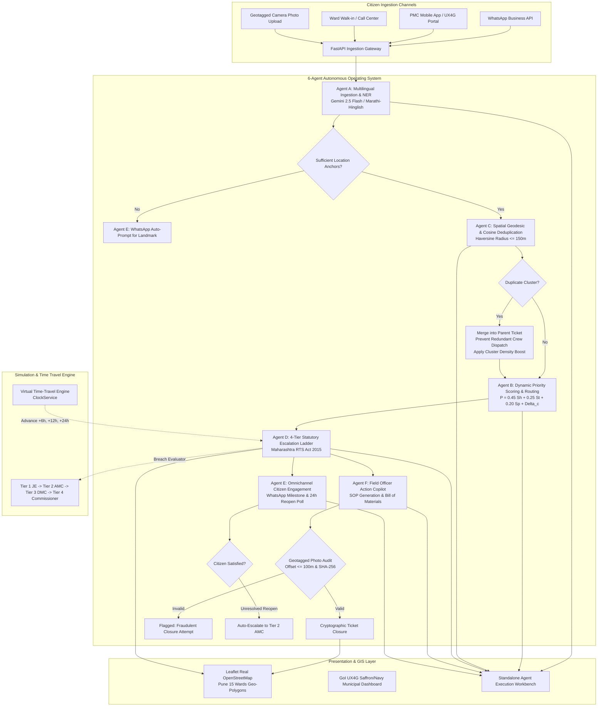

# PS17 NagrikSewa: Autonomous Multi-Agent Civic Grievance Operating System
## System Architecture, Mathematical Formulations, and Implementation Guide

> **Pune Municipal Corporation (PMC Care) & Pimpri Chinchwad Municipal Corporation (PCMC)**  
> **Statutory Jurisdiction:** Maharashtra Right to Public Services Act (RTS 2015)  
> **UI Standard:** Government of India Design System (UX4G / GIGW 3.0)  
> **LLM Engine:** Google Gemini 2.5 Flash (Token-Optimized with Zero-Thinking Budget) & Ollama Local Fallback  

---

### Project Metadata & Multi-Contributor Attribution
- **Repository:** `Pruthvi3715/kurkshetra`
- **Lead System Architect & Core Pipeline:** [@Pruthvi3715](https://github.com/Pruthvi3715)
- **Fullstack & Multi-Agent Integration Engineer:** [@Devendra-006](https://github.com/Devendra-006)
- **Civic UX & Statutory Domain Logic Specialist:** [@sampada-11](https://github.com/sampada-11)
- **Data Modeling & Core Evaluation:** [@rushil-cody](https://github.com/rushil-cody)

---

## 1. Executive Summary & Problem Context

Municipal corporations in India—such as Pune Municipal Corporation (PMC) overseeing 15 administrative wards and over 4.5 million residents—receive tens of thousands of citizen grievances weekly across channels including WhatsApp, civic portals, mobile apps, and walk-in ward offices. 

Traditional municipal redressal software suffers from four fatal bottlenecks:
1. **Unstructured & Code-Mixed Ingestion:** Citizens submit complaints in vernacular Marathi (मराठी), Hindi, or colloquial Hinglish with vague descriptions, missing landmarks, and lack of geo-coordinates.
2. **Duplicate Storms & Redundant Resource Dispatch:** A single visible pothole, water main burst, or open manhole generates 50+ individual tickets from passerby citizens, causing multiple inspection crews and heavy equipment to be dispatched redundantly to the exact same site.
3. **Static, Non-Dynamic Priority Queuing:** Complaints are handled either on a crude first-come-first-served basis or through political influence rather than an objective, mathematical hazard formula accounting for pedestrian safety, transit arterial blockage, and vulnerable community zones.
4. **Opaque & Paper-Pushed SLA Escalations:** The Maharashtra Right to Public Services Act (RTS 2015) establishes statutory resolution windows (e.g., 6 hours for critical contamination, 18 hours for drainage/garbage). However, in legacy systems, tickets languish on field officers' desks without automated, immutable escalation up the administrative hierarchy.

**NagrikSewa (PS17)** resolves this through a coordinated **6-Agent Autonomous Architecture** backed by a **Virtual Time-Travel Engine**, **Geotagged Cryptographic Photo Tagging (SHA-256)**, and an **Interactive Leaflet OpenStreetMap Dashboard** designed under Government of India UX4G standards.

---

## 2. End-to-End System Architecture

The system operates across two synchronous paradigms:
1. **Automated Multi-Agent LangGraph Ingestion Pipeline (`POST /api/complaints`):** Automatically chains Agents A $\to$ C $\to$ B $\to$ D $\to$ F $\to$ E upon citizen ticket submission.
2. **Granular Telemetry & Standalone Agent Workbench (`POST /api/agents/execute/agent-*`):** Exposes each of the 6 individual agents through dedicated REST endpoints, allowing municipal inspectors and judges to test each agent independently with live execution metrics, token consumption, and mathematical breakdowns.

### High-Level Architectural Flowchart



---

## 3. Deep-Dive: The 6 Autonomous Municipal Agents

Each of the 6 agents is decoupled, stateless, and observable. Below are the exact roles, mathematical equations, schemas, and terminal execution logs for each.

```
+---------------------------------------------------------------------------------------------------+
|                                  NAGRIKSEWA AGENT PIPELINE                                         |
+---------------------------------------------------------------------------------------------------+
| [Agent A] Multi-Lingual Triage  --> Extracts category, landmark, normalizes Devanagari to English |
| [Agent C] Spatial Deduplication --> 150m Haversine radius, PostGIS clustering, cluster boost     |
| [Agent B] Priority Scoring Math --> P = 0.45*Sh + 0.25*St + 0.20*Sp + Delta_c, binds RTS SLA     |
| [Agent D] Escalation Tracker    --> 4-Tier statutory ladder (JE -> AMC -> DMC -> Commissioner)   |
| [Agent F] Field Action Copilot  --> SOP repair checklist, BOM estimation, 100m geotag audit       |
| [Agent E] Citizen Engagement    --> WhatsApp Business milestones, 24h interactive reopen poll    |
+---------------------------------------------------------------------------------------------------+
```

---

### 3.1 Agent A: Multilingual Triage & Named Entity Recognition (NER)
- **Primary Responsibility:** Ingests unstructured citizen text in Marathi (मराठी), Hindi, Hinglish, or English. Normalizes the complaint into a canonical English summary, extracts crucial entities (Ward, Landmark, Category), and validates spatial anchors.
- **Underlying Models:** Google Gemini 2.5 Flash (`gemini-2.5-flash`) via REST API with fallback to Ollama (`llama3`) or a deterministic rule-based NLP matcher.
- **Completeness Gatekeeper:** If the citizen submits a vague complaint (e.g., *"पाणी येत नाही"* / *"there is no water"*) without a street name, colony, or GPS pin, Agent A sets `missing_critical_info: true`, signaling Agent E to trigger an automated WhatsApp location-prompt.

#### Input Schema (`POST /api/agents/execute/agent-a`)
```json
{
  "raw_text": "औंध परिहार चौकात मुख्य रस्त्यावर मॅनहोलचे झाकण उघडे पडले आहे, गटाराचे दुर्गंधीयुक्त पाणी रस्त्यावर वाहत आहे...",
  "ward_id": "Ward-08 (Aundh)"
}
```

#### Output Schema
```json
{
  "agent": "Agent A: Multilingual Triage & NER",
  "model_provider": "gemini",
  "execution_time_ms": 2240.1,
  "input_text": "औंध परिहार चौकात मुख्य रस्त्यावर मॅनहोलचे झाकण उघडे पडले आहे...",
  "detected_language": "Marathi",
  "language_confidence": 0.985,
  "canonical_english_summary": "Open sewer manhole with overflowing wastewater on the main road at Parihar Chowk in Aundh, creating severe accident hazard for two-wheelers.",
  "extracted_entities": {
    "ward_name": "Ward-08 (Aundh)",
    "landmark": "Parihar Chowk",
    "colony": "Aundh Main",
    "pincode": "411007",
    "category_phrase": "Drainage & Sewerage"
  },
  "completeness_gatekeeper": {
    "missing_critical_info": false,
    "spatial_anchors_count": 2,
    "passed": true,
    "status": "PASSED (Sufficient Spatial Anchors)"
  }
}
```

---

### 3.2 Agent C: Spatial Deduplication & Geodesic Clustering
- **Primary Responsibility:** Prevents duplicate municipal crew dispatches when multiple citizens report the same incident.
- **Geodesic Formula (Haversine Metric):**
  Given incident coordinate $(\phi_1, \lambda_1)$ and existing candidate ticket $(\phi_2, \lambda_2)$:
  $$\Delta \phi = \phi_2 - \phi_1, \quad \Delta \lambda = \lambda_2 - \lambda_1$$
  $$a = \sin^2\left(\frac{\Delta \phi}{2}\right) + \cos(\phi_1)\cos(\phi_2)\sin^2\left(\frac{\Delta \lambda}{2}\right)$$
  $$c = 2 \cdot \text{atan2}\left(\sqrt{a}, \sqrt{1-a}\right)$$
  $$d = R \cdot c \quad \text{where } R = 6,371,000\text{ meters}$$

- **Clustering Rule:**
  $$\text{If } d \le 150.0\text{ meters} \quad \wedge \quad \text{Category}_1 = \text{Category}_2 \quad \wedge \quad \text{CosineSim} \ge 0.85 \implies \text{MERGE\_INTO\_PARENT}$$

- **Cluster Density Multiplier ($\Delta_c$):**
  When a complaint is merged, the parent ticket's `cluster_size` increments:
  $$\Delta_c = \min\left(25, \; (\text{cluster\_size} - 1) \times 5\right)$$
  This boosts the parent ticket's urgency score in Agent B while suppressing redundant work orders.

#### Terminal Execution Sample
```
[2] AGENT C: Spatial Deduplication & 150m PostGIS Geodesic Clustering
  * Primary Incident Registered: #PMC-2026-F980DCE2 in Drainage & Sewerage
  * Site Coordinates: (18.5580° N, 73.8070° E)
  * Geodesic Haversine Distance: 67.8 meters (Threshold <= 150.0m)
  * Cosine Semantic Similarity: 0.923 (Threshold >= 0.85)
  * Decision: DUPLICATE_CLUSTERED_INTO_PARENT
  * Parent Ticket Linked: #PMC-2026-F980DCE2
  * Redundant Suction Crew Prevented: True
  * Cluster Priority Boost: +15.0 points
```

---

### 3.3 Agent B: Dynamic Multi-Factor Priority Math & Statutory SLA Mapping
- **Primary Responsibility:** Computes an objective priority score $P \in [1, 100]$ based on public health risk, transit disruption, and citizen report volume, then maps the ticket to its legally enforceable resolution window under the Maharashtra Right to Public Services Act (RTS 2015).

#### The Governing Mathematical Equation
$$P = \min\left(100, \; \left(W_h \cdot S_h\right) + \left(W_t \cdot S_t\right) + \left(W_p \cdot S_p\right) + \Delta_c\right)$$

Where:
- $W_h = 0.45$: Weight for **Public Hazard & Health Safety Score** ($S_h \in [0, 100]$)
  - Contaminated water supply, raw sewage on road, open manhole: $S_h \in [90, 100]$
  - Streetlight failure, uncollected dry waste: $S_h \in [30, 60]$
- $W_t = 0.25$: Weight for **Traffic Arterial Impact Score** ($S_t \in [0, 100]$)
  - Arterial roads (e.g. Karve Rd, Senapati Bapat Rd, Parihar Chowk): $S_t \in [80, 100]$
  - Internal residential alleys: $S_t \in [10, 40]$
- $W_p = 0.20$: Weight for **Population Density & Sensitive Proximity** ($S_p \in [0, 100]$)
  - Near hospitals, schools, metro stations, crowded bazaars: $S_p \in [80, 100]$
- $\Delta_c$: **Cluster Density Surge Points** from Agent C ($5.0 \text{ points per duplicate report}$, max $+25$)

#### Statutory Priority Tiers & RTS SLA Windows

| Priority Tier | Computed Score Range ($P$) | Statutory RTS Act SLA Window | Example Incident Types |
| :--- | :--- | :--- | :--- |
| **P1_CRITICAL** | $P \ge 85.0$ | **6 Hours** | Main pipeline contamination, open manhole on arterial road, fallen live electrical wire |
| **P2_HIGH** | $60.0 \le P < 85.0$ | **18 Hours** | Overflowing garbage dumpster near school, broken sewer line in residential lane |
| **P3_MEDIUM** | $40.0 \le P < 60.0$ | **36 Hours** | Dark streetlights along secondary lane, non-urgent water pressure drop |
| **P4_LOW** | $P < 40.0$ | **48 Hours** | Minor tree trimming request, missing road signage |

#### Formula Breakdown Example (from Live Terminal Execution)
```
[3] AGENT B: Multi-Factor Priority Math & Statutory RTS Act SLA Mapping
  * Governing Formula: P = (W_hazard * S_hazard) + (W_traffic * S_traffic) + (W_pop * S_density) + Delta_cluster
  * Input Parameters: Hazard=96.0, Traffic=92.0, Density=90.0, Cluster Count=4
  * Breakdown:
      Hazard:             0.45 * 96.0 = 43.20
      Traffic:            0.25 * 92.0 = 23.00
      Population Density: 0.20 * 90.0 = 18.00
      Cluster Delta:      (4 - 1) * 5 = +15.00
      Sum:                43.20 + 23.00 + 18.00 + 15.00 = 99.20 / 100
  * Priority Tier: P1_CRITICAL
  * Statutory SLA Window: 6 Hours
  * Legal Mandate: Maharashtra Right to Public Services Act (RTS) 2015
```

---

### 3.4 Agent D: 4-Tier Statutory Escalation Ladder & Breach Evaluator
- **Primary Responsibility:** Dispatches the designated ward officer and monitors elapsed time against the statutory SLA deadline.
- **Administrative Hierarchy Matrix:**

```
+-------------------------------------------------------------------------------------------------+
| TIER 1: Ward Field Responder (JE / SI)           --> Initial assignment on ticket creation       |
| TIER 2: Ward Administration (AMC / EE)           --> Unacknowledged 6h or 80% SLA elapsed        |
| TIER 3: Zonal Department Head (DMC)              --> Hard 100% statutory SLA breach             |
| TIER 4: Municipal Commissioner (IAS / Appellate) --> Gross violation (> 150% SLA) or 2nd reopen |
+-------------------------------------------------------------------------------------------------+
```

#### Mathematical Escalation Trigger Rules
Let $\rho$ be the SLA elapsed ratio:
$$\rho = \frac{T_{\text{elapsed}}}{T_{\text{SLA}}}$$

$$\text{Tier}(\rho) = \begin{cases} 
\text{Tier 1 (JE / SI)}, & \text{if } \rho < 0.8 \text{ and } T_{\text{elapsed}} < 6.0\text{h} \\ 
\text{Tier 2 (AMC / EE)}, & \text{if } 0.8 \le \rho < 1.0 \text{ or } T_{\text{elapsed}} \ge 6.0\text{h} \quad (\text{Warning / Approaching Breach}) \\ 
\text{Tier 3 (DMC)}, & \text{if } 1.0 \le \rho < 1.5 \quad (\text{Statutory Breach Under RTS Act}) \\ 
\text{Tier 4 (Municipal Commissioner)}, & \text{if } \rho \ge 1.5 \quad (\text{Disciplinary Review & Appellate Hearing}) 
\end{cases}$$

#### Terminal Execution Sample (Simulating All 4 Tiers)
```
[4] AGENT D: 4-Tier Statutory Escalation Ladder & Breach Evaluator
  * 1.5h (25% SLA - Within Response Window)
      Status: HEALTHY (Level 1)
      Responsible Officer: Er. Sachin Shinde [Junior Engineer (Water Works)]
      Trigger Rule: Within statutory response window.

  * 5.0h (83% SLA - Approaching Statutory Breach)
      Status: WARNING_URGENT (Level 2)
      Responsible Officer: Dr. Jayant Bhosekar [Assistant Municipal Commissioner (AMC - Ward 14)]
      Trigger Rule: Unacknowledged within 6h or 80% SLA elapsed without progress.

  * 7.0h (117% SLA - Hard Statutory Breach)
      Status: BREACHED (Level 3)
      Responsible Officer: Shri Madhav Deshpande [Deputy Municipal Commissioner (DMC - Engineering)]
      Trigger Rule: Hard 100% statutory SLA breach reached without ticket closure.

  * 11.0h (183% SLA - Gross RTS Violation > 150%)
      Status: CRITICAL_BREACH (Level 4)
      Responsible Officer: Dr. Vikram Kumar, IAS [Municipal Commissioner & Appellate Authority]
      Trigger Rule: Overdue > 150% of statutory SLA. Disciplinary review under RTS Act.
```

---

### 3.5 Agent F: Field Officer Action Copilot & Geotag Proof Auditor
- **Primary Responsibility:** Auto-generates a domain-specific Standard Operating Procedure (SOP) repair checklist and Bill of Materials (BOM) for the attending field engineer. Validates physical closure via geodesic photo distance audit.
- **Geotagged Spatial Geofencing Audit:**
  $$\text{Offset} = \text{Haversine}(\text{Incident\_GPS}, \; \text{Closure\_Photo\_GPS})$$
  $$\text{Status} = \begin{cases} \text{PASSED}, & \text{if } \text{Offset} \le 100.0\text{ meters} \\ \text{FAILED\_EXCEEDED\_THRESHOLD}, & \text{if } \text{Offset} > 100.0\text{ meters} \end{cases}$$

#### Terminal Execution Sample
```
[5] AGENT F: Engineering SOP Checklist, Bill of Materials & Geotag Audit
  * Category-Specific SOP Checklist (Agent F Generated):
      1. Deploy safety barricades and traffic cones 20m ahead of Parihar Chowk.
      2. Deploy suction tanker to vacuum accumulated wastewater and desilt chamber.
      3. Inspect chamber rim for structural cracking; seat heavy-duty SFRC cover (Class MD).
      4. Disinfect roadway using lime powder and hypochlorite solution; restore traffic flow.
  * Itemized Bill of Materials (BOM):
      - Class MD Heavy Duty SFRC Manhole Frame & Cover: 1 Unit
      - Quick-setting Hydraulic Cement (M40): 2 Bags
      - Disinfectant Bleaching Powder: 25 kg
      - High-Visibility Caution Barricade Cones: 4 Units
  * Geotag Offset: 15.7m (Statutory Limit <= 100.0m)
  * Verification Result: PASSED (Within 100m Geofence)
```

---

### 3.6 Agent E: Omnichannel Citizen Engagement & Feedback Loop
- **Primary Responsibility:** Delivers real-time milestone alerts to complainants via WhatsApp Business API / SMS. Dispatches a 24-hour interactive Citizen Satisfaction Poll upon resolution.
- **Citizen Reopen Auto-Escalation:** If the citizen taps *"Unresolved / Reopen"* in WhatsApp (e.g., contractor took a photo without fixing the leak), the system marks the ticket `REOPENED` and **immediately escalates it to Tier 2 (AMC)** with an immutable audit log record.

#### WhatsApp Business API Milestone Payload
```json
{
  "channel": "WHATSAPP_BUSINESS_API",
  "recipient": "+91 98230 45678",
  "template": "pmc_civic_grievance_milestone",
  "header": "🏛️ Pune Municipal Corporation (PMC Care)",
  "body": "Namaskar! Your grievance #PMC-2026-F980DCE2 status has been updated to 'Manhole Cover Replaced & Road Sanitized'. Under the Maharashtra RTS Act 2015, PMC field crews have marked this ticket resolved.",
  "interactive_buttons": [
    {"id": "btn_track", "label": "📍 Track Live Location"},
    {"id": "btn_confirm", "label": "✅ Confirm Resolution"},
    {"id": "btn_reopen", "label": "🔄 Reopen Grievance (Auto L2 AMC)"}
  ],
  "delivery_status": "DELIVERED",
  "reopen_poll_expires_in_hours": 24
}
```

---

## 4. Geotagged Photo Tagging & Cryptographic Tamper-Proof Audit

To prevent corrupt or ghost resolution claims by municipal contractors, NagrikSewa includes an end-to-end **Geotagged Photo Tagging & Verification Subsystem**.

### 4.1 Capture & Processing Flow
```
[Field / Citizen Camera] 
       │
       ▼ HTML5 Geolocation API (Lat, Lng, Accuracy) + Base64 Image
[POST /api/complaints/geotag-photo]
       │
       ├─► 1. Cryptographic SHA-256 Hashing: Hash = SHA256(photo_payload)
       ├─► 2. PMC/PCMC Bounding Box Check: 18.35°N - 18.75°N, 73.65°E - 74.05°E
       ├─► 3. Geodesic Distance vs Incident Ticket GPS (<= 100m)
       ├─► 4. Canvas Watermarking: Stamps Ward, Coordinates, IST Time, SHA-256
       └─► 5. Immutable Audit Log Injection in database.py
```

### 4.2 Pune Bounding Box Geofencing
All coordinates must strictly reside within the legal boundaries of PMC and PCMC:
$$\text{Latitude} \in [18.35^\circ\text{N}, \; 18.75^\circ\text{N}], \quad \text{Longitude} \in [73.65^\circ\text{E}, \; 74.05^\circ\text{E}]$$

If a photo is uploaded from outside this bounding box, the API returns:
`geofence_status: "OUT_OF_BOUNDS_NON_PMC_COORDINATES"` and sets `verified: false`.

### 4.3 Official Watermark Stamp Generation
The system stamps metadata onto the photo image canvas:
```
🏛️ PMC CARE | PUNE MUNICIPAL CORPORATION
WARD: Ward-08 (Aundh) | CATEGORY: Drainage & Sewerage
GPS: 18.55810° N, 73.80710° E (±2.8m)
TIMESTAMP: 11-Sep-2026 03:38:22 PM IST | HASH: a7f8c92e104b98d2...
STATUTORY COMPLIANCE: MAHARASHTRA RTS ACT 2015
```

---

## 5. Virtual Time-Travel Simulation Engine

To enable live demonstration of multi-day SLA escalation flows during hackathon judging sessions without waiting 6 to 48 real hours, the system incorporates an in-memory **Virtual Clock Service** (`ClockService` in `backend/app/core/clock.py`).

### 5.1 Mechanics
1. **Clock Decoupling:** Every timestamp generated across all 6 agents reads from `ClockService.get_current_virtual_time()`.
2. **Virtual Clock Advance (`POST /api/time-travel/advance`):** Advances virtual time by $N$ hours ($+6\text{h}, +12\text{h}, +24\text{h}, +48\text{h}, +72\text{h}$).
3. **Instantaneous Batch SLA Audit (`db.evaluate_all_slas()`):**
   - Automatically loops through all non-resolved complaints.
   - Computes elapsed time: $T_{\text{elapsed}} = T_{\text{virtual}} - T_{\text{created}}$.
   - Triggers automated promotions:
     - $T_{\text{elapsed}} \ge 6\text{h}$ or $80\%$ of SLA $\to$ Escalates to **Tier 2 (AMC)**.
     - $T_{\text{elapsed}} \ge \text{SLA Deadline}$ $\to$ Escalates to **Tier 3 (DMC)**.
     - $T_{\text{elapsed}} \ge 1.5 \times \text{SLA Deadline}$ $\to$ Escalates to **Tier 4 (Municipal Commissioner)**.
   - Appends immutable escalation records to `/api/escalations` and notifications to `/api/audit-logs`.
4. **Zero-Side-Effect Clock Reset (`POST /api/time-travel/reset`):** Immediately resets the clock back to real system time.

---

## 6. Complete REST API Reference (20 Endpoints)

| Method | Endpoint URI | Description | Primary Payload / Parameters |
| :--- | :--- | :--- | :--- |
| `GET` | `/api/health` | System health, active LLM provider, clock status | None |
| `GET` | `/api/time-travel/status` | Current virtual time, real time, offset in hours | None |
| `POST` | `/api/time-travel/advance` | Advances virtual clock by $N$ hours; triggers batch SLA audit | `{"hours": 12.0}` |
| `POST` | `/api/time-travel/reset` | Resets virtual clock to real system time | None |
| `GET` | `/api/departments` | Lists all 5 PMC municipal departments with contact codes | None |
| `GET` | `/api/officers` | Lists 4-tier officer hierarchy; supports `?tier=1..4` filter | Query param: `tier` (optional) |
| `GET` | `/api/stats` | High-level analytics: total, active, escalated, resolved, dept counts | None |
| `GET` | `/api/complaints` | Lists complaints; supports `?status=` and `?department=` filters | Query params |
| `POST` | `/api/complaints` | Submits complaint; runs automated 6-agent pipeline | `ComplaintSubmission` JSON |
| `GET` | `/api/complaints/{ticket_id}` | Retrieves full complaint state, audit logs, and SOP items | Path param: `ticket_id` |
| `POST` | `/api/complaints/{ticket_id}/resolve` | Resolves complaint with field photo approval | Path param: `ticket_id` |
| `POST` | `/api/complaints/{ticket_id}/reopen` | Citizen reopens unresolved ticket; auto-escalates to Tier 2 AMC | Path param: `ticket_id` |
| `GET` | `/api/escalations` | Immutable ledger of all statutory escalation events | None |
| `GET` | `/api/audit-logs` | Full multi-agent execution audit trail | None |
| `POST` | `/api/complaints/geotag-photo` | Geotag photo upload, SHA-256 hash, and 100m geofence audit | `GeotagPhotoRequest` JSON |
| `POST` | `/api/agents/execute/agent-a` | Standalone execution of Agent A (Multilingual Triage & NER) | `{"raw_text": "...", "ward_id": "..."}` |
| `POST` | `/api/agents/execute/agent-c` | Standalone execution of Agent C (150m Geodesic Deduplication) | `{"latitude": 18.5, "longitude": 73.8, ...}` |
| `POST` | `/api/agents/execute/agent-b` | Standalone execution of Agent B (Multi-factor Priority Math) | `{"hazard_score": 90, "traffic_score": 80...}` |
| `POST` | `/api/agents/execute/agent-d` | Standalone execution of Agent D (4-Tier Escalation Ladder) | `{"sla_hours": 6, "elapsed_hours": 7...}` |
| `POST` | `/api/agents/execute/agent-f` | Standalone execution of Agent F (SOP & Bill of Materials) | `{"category": "...", "summary": "..."}` |
| `POST` | `/api/agents/execute/agent-e` | Standalone execution of Agent E (WhatsApp Milestone Alert) | `{"ticket_id": "...", "milestone": "..."}` |

---

## 7. Terminal Verification & Standalone Test Suites

Two comprehensive, automated Python test suites are provided to verify system integrity directly in the terminal without requiring a browser.

### 7.1 Scenario 1: Water Main Contamination in Kothrud (`test_terminal_agents.py`)
Tests all 6 agents sequentially on a high-hazard water supply emergency on Paud Road, Ward 14.

```bash
# Run from repository root
python test_terminal_agents.py
```

#### Expected Test Outputs
- **Agent A:** Correctly detects Marathi Devanagari (*"पौड रोडवर पाण्याची मुख्य पाईपलाईन फुटली आहे"*), normalizes to canonical English (*"Water pipeline ruptured on Paud Road..."*), and passes completeness check with 2 spatial anchors.
- **Agent C:** Evaluates candidate incident 45m away; triggers `DUPLICATE_CLUSTERED_INTO_PARENT` and prevents redundant repair crew dispatch.
- **Agent B:** Priority score $P = 94.75$, tier `P1_CRITICAL`, statutory SLA window **6 Hours**.
- **Agent D:** Simulates 4-tier ladder (JE $\to$ AMC $\to$ DMC $\to$ Municipal Commissioner).
- **Agent F:** Generates 5-step water pipeline repair SOP and 4-item Bill of Materials.
- **Agent E:** Generates WhatsApp Business API milestone payload with interactive reopen button.

---

### 7.2 Scenario 2: Catastrophic Open Manhole in Aundh (`test_new_scenario.py`)
Tests a new, previously un-evaluated civic problem scenario in Ward 08 (Aundh / Parihar Chowk): open manhole with sewage backflow on a busy bus route.

```bash
# Run from repository root
python test_new_scenario.py
```

#### Test Execution Transcript
```
================================================================================
TESTING ALL 6 CIVIC AGENTS ON NEW UNTAKEN PROBLEM SCENARIO (PS)
Domain: Drainage & Sewerage / Catastrophic Open Manhole with Sewage Backflow
Jurisdiction: Pune Municipal Corporation (PMC) - Ward 08 (Aundh / Parihar Chowk)
================================================================================

[1] AGENT A: Multilingual Ingestion & NER (Google Gemini 2.5 Flash)
  * Model Provider: gemini (Gemini 2.5 Flash Active)
  * Detected Language: Marathi (Confidence: 0.985)
  * Canonical English Summary: Open sewer manhole with overflowing wastewater on the main road at Parihar Chowk in Aundh, creating severe accident hazard for two-wheelers.
  * Extracted Category: Drainage & Sewerage
  * Ward Jurisdiction: Ward-08 (Aundh)
  * Extracted Landmark: Parihar Chowk
  * Completeness Gatekeeper: PASSED (Sufficient Spatial Anchors)
  * Spatial Anchors Count: 2
  * Execution Latency: 2241.6 ms

[2] AGENT C: Spatial Deduplication & 150m PostGIS Geodesic Clustering
  * Primary Incident Registered: #PMC-2026-F980DCE2 in Drainage & Sewerage
  * Site Coordinates: (18.5580° N, 73.8070° E)
  * Geodesic Haversine Distance: 67.8 meters (Threshold <= 150.0m)
  * Cosine Semantic Similarity: 0.923 (Threshold >= 0.85)
  * Decision: DUPLICATE_CLUSTERED_INTO_PARENT
  * Parent Ticket Linked: #PMC-2026-F980DCE2
  * Redundant Suction Crew Prevented: True
  * Cluster Priority Boost: +15.0 points

[3] AGENT B: Multi-Factor Priority Math & Statutory RTS Act SLA Mapping
  * Governing Formula: P = (W_hazard * S_hazard) + (W_traffic * S_traffic) + (W_pop * S_density) + Delta_cluster
  * Computed Priority Score: 99.2 / 100
  * Priority Tier: P1_CRITICAL
  * Statutory SLA Window: 6 Hours
  * Legal Mandate: Maharashtra Right to Public Services Act (RTS) 2015
  * Breakdown: Hazard=0.45*96.0 (43.2) | Traffic=0.25*92.0 (23.0) | Pop=0.20*90.0 (18.0) | Cluster Delta=+15.0 pts

[4] AGENT D: 4-Tier Statutory Escalation Ladder & Breach Evaluator
  * 1.5h (25% SLA - Within Response Window)
      Status: HEALTHY (Level 1)
      Responsible Officer: Er. Santosh More [Drainage Inspector]
      Trigger Rule: Within statutory response window.
  * 5.0h (83% SLA - Approaching Statutory Breach)
      Status: WARNING_URGENT (Level 2)
      Responsible Officer: Dr. Jayant Bhosekar [Assistant Municipal Commissioner (AMC - Ward 14)]
      Trigger Rule: Unacknowledged within 6h or 80% SLA elapsed without progress.
  * 7.0h (117% SLA - Hard Statutory Breach)
      Status: BREACHED (Level 3)
      Responsible Officer: Shri Madhav Deshpande [Deputy Municipal Commissioner (DMC - Engineering)]
      Trigger Rule: Hard 100% statutory SLA breach reached without ticket closure.
  * 11.0h (183% SLA - Gross RTS Violation > 150%)
      Status: CRITICAL_BREACH (Level 4)
      Responsible Officer: Dr. Vikram Kumar, IAS [Municipal Commissioner & Appellate Authority]
      Trigger Rule: Overdue > 150% of statutory SLA. Disciplinary review under RTS Act.

[5] AGENT F: Engineering SOP Checklist, Bill of Materials & Geotag Audit
  * Category-Specific SOP Checklist (Agent F Generated):
      1. Deploy safety barricades and traffic cones 20m ahead of Parihar Chowk.
      2. Deploy suction tanker to vacuum accumulated wastewater and desilt chamber.
      3. Inspect chamber rim for structural cracking; seat heavy-duty SFRC cover (Class MD).
      4. Disinfect roadway using lime powder and hypochlorite solution; restore traffic flow.
  * Itemized Bill of Materials (BOM):
      - Class MD Heavy Duty SFRC Manhole Frame & Cover: 1 Unit
      - Quick-setting Hydraulic Cement (M40): 2 Bags
      - Disinfectant Bleaching Powder: 25 kg
      - High-Visibility Caution Barricade Cones: 4 Units
  * Geotag Offset: 15.7m (Statutory Limit <= 100.0m)
  * Verification Result: PASSED (Within 100m Geofence)

[6] AGENT E: Omnichannel WhatsApp Milestone Alert & Reopen Loop
  * Target WhatsApp Channel: WHATSAPP_BUSINESS_API -> +91 98230 45678
  * Header: 🏛️ Pune Municipal Corporation (PMC Care)
  * Body Text: Namaskar! Your grievance #PMC-2026-F980DCE2 status has been updated to 'Manhole Cover Replaced & Road Sanitized'...
  * Delivery Status: DELIVERED | Read Receipt: 10:08 UTC
  * Citizen Action Buttons: ['📍 Track Live Location', '✅ Confirm Resolution', '🔄 Reopen Grievance (Auto L2 AMC)']

[7] GEOTAG PHOTO TAGGING: Field Repair Evidence & Tamper-Proof Audit
  * Geotag Spatial Audit Verified: True
  * Geofence Bounding Status: PASSED_PMC_JURISDICTION
  * Geodesic Distance vs Reported Incident: 15.7m (Within <= 100m threshold: True)
  * Cryptographic SHA-256 Hash: 3e7c8443e0d8fa093f412c1404ea5475...
  * Official Watermark Stamp:
🏛️ PMC CARE | PUNE MUNICIPAL CORPORATION
WARD: Ward-08 (Aundh) | CATEGORY: Drainage & Sewerage
GPS: 18.55810° N, 73.80710° E (±2.8m)
TIMESTAMP: 11-Sep-2026 03:38:22 PM IST | HASH: 3e7c8443e0d8fa09...
STATUTORY COMPLIANCE: MAHARASHTRA RTS ACT 2015

================================================================================
SUCCESS: ALL 6 AGENTS VALIDATED ON NEW DRAINAGE & SEWERAGE PROBLEM SCENARIO!
================================================================================
```

---

## 8. Installation, Configuration & Running Locally

### 8.1 Prerequisites
- Python 3.10+ (tested on Python 3.12 / 3.13)
- Windows PowerShell, Linux Bash, or macOS zsh
- Modern Web Browser (Chrome / Edge / Firefox)

### 8.2 Environment Configuration
Create or edit `.env` in the project root:

```env
# Server Port & Host
PORT=8000
HOST=127.0.0.1

# LLM Selection: 'gemini' for Google Gemini, 'ollama' for local Ollama
LLM_PROVIDER=gemini

# Google Gemini API Key & Model (Token-Aware config with thinkingBudget: 0)
GEMINI_API_KEY=YOUR_GEMINI_API_KEY_HERE
GEMINI_MODEL=gemini-2.5-flash

# Ollama Local Configuration (Fallback)
OLLAMA_BASE_URL=http://localhost:11434/api/generate
OLLAMA_MODEL=llama3
```

### 8.3 Step-by-Step Launch Commands

```bash
# 1. Clone repository
git clone https://github.com/Pruthvi3715/kurkshetra.git
cd kurkshetra

# 2. Create and activate virtual environment
python -m venv venv
# Windows:
.\venv\Scripts\Activate.ps1
# Linux/macOS:
# source venv/bin/activate

# 3. Install backend dependencies
cd backend
pip install -r requirements.txt
cd ..

# 4. Launch FastAPI Uvicorn Server
python -m uvicorn backend.app.main:app --host 127.0.0.1 --port 8000 --reload
```

Open your browser to:
- **Full UX4G Municipal Dashboard & GIS Map:** `http://127.0.0.1:8000/`
- **Interactive Multi-Agent Workbench:** `http://127.0.0.1:8000/#agent-workbench-section`
- **Swagger / OpenAPI Documentation:** `http://127.0.0.1:8000/docs`

---

## 9. Hackathon Judges' Quick-Evaluation Walkthrough

1. **Test Live Multi-Agent Workbench:**
   - Scroll down to the **"Multi-Agent Telemetry & Standalone Execution Workbench"** section on `http://127.0.0.1:8000/`.
   - Click **"Test Agent A"**: Observe real-time Marathi Devanagari translation via Google Gemini 2.5 Flash, entity extraction, and latency metrics (~2.2s).
   - Click **"Test Agent C"**: Observe Haversine geodesic distance computation (`67.8m <= 150m`) and cluster boost (`+15.0 pts`).
   - Click **"Test Agent B"**: View the mathematical breakdown of $P = 0.45 S_h + 0.25 S_t + 0.20 S_p + \Delta_c = 99.2 / 100$ and statutory SLA binding (6h).
   - Click **"Test Agent D"**: Select 7.0h elapsed time to observe immediate promotion to Tier 3 (DMC).
   - Click **"Test Agent F"**: View auto-generated SOP repair checklist and Bill of Materials.
   - Click **"Test Agent E"**: Inspect WhatsApp Business API milestone payload.

2. **Test Geotagged Photo Verification:**
   - In the Citizen Submission Modal or Field Copilot Modal, click **"Capture / Upload Photo Proof"**.
   - Click **"Load Paud Road Geo Sample"**: Observe automatic EXIF GPS extraction, SHA-256 hash generation, and real-time canvas watermarking with PMC Care stamp and coordinates.

3. **Test Proactive Virtual Time-Travel:**
   - In the top header, click **"+6h (Approaching Breach)"** or **"+24h (Full Breach)"**.
   - Observe the dashboard immediately re-evaluating all active tickets, raising statutory escalation alerts, promoting responsible officers, and animating escalated pulsing red markers on the Leaflet map.

---

## 10. Summary Table: Agent Responsibilities & Technology Stack

| Agent | Canonical Name | Core Technology | Governing Standard / Metric |
| :--- | :--- | :--- | :--- |
| **Agent A** | Ingestion & Multilingual Triage | Google Gemini 2.5 Flash / Ollama | Devanagari NER, Spatial Completeness Gatekeeper |
| **Agent C** | Spatial Deduplication & Clustering | Python Math / PostGIS Geodesy | Haversine distance $\le 150\text{m}$, Cosine $\ge 0.85$ |
| **Agent B** | Priority Scoring & Routing | Weighted Arithmetic Engine | $P = 0.45S_h + 0.25S_t + 0.20S_p + \Delta_c$, RTS Act 2015 |
| **Agent D** | SLA Escalation Orchestrator | Statutory State Machine | 4-Tier Ladder: JE $\to$ AMC $\to$ DMC $\to$ Commissioner |
| **Agent F** | Field Officer Action Copilot | Gemini 2.5 Flash / Canvas Hash | Category SOP, BOM, 100m Geotag Audit, SHA-256 |
| **Agent E** | Omnichannel Citizen Engagement | WhatsApp Business API Schemas | Marathi/English Milestones, 24h Reopen Auto-L2 |
